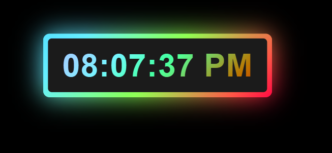

# 🕒 Digital Clock

A simple and responsive **Digital Clock Web Application** built using **HTML, CSS, and JavaScript**. The clock displays the current time in **12-hour format** with hours, minutes, seconds, and AM/PM.

## 🚀 Live Demo

 🔗 **[Digital Clock ](https://digitalclock-eta-five.vercel.app/)**
 
---

## 📌 Project Overview

The Digital Clock is a lightweight web application that displays the current system time in real time.

JavaScript's `Date` object is used to get the current hours, minutes, and seconds. The time is automatically updated every second.

---

## ✨ Features

* 🕐 Displays current time in real time
* ⏱️ Shows hours, minutes, and seconds
* 🌅 Supports AM/PM format
* 🔢 Adds leading zeros to single-digit values
* 📱 Responsive design
* ⚡ Updates automatically every second
* 🎨 Simple and clean user interface

---

## 🛠️ Technologies Used

* **HTML5** – Structure of the application
* **CSS3** – Styling and layout
* **JavaScript** – Time calculation and real-time updates

---

## 📂 Project Structure

```text
Digital-Clock/
│
├── index.html
├── styles.css
├── script.js
└── README.md
```

---

## ⚙️ How It Works

The application uses JavaScript's `Date()` object to retrieve the current system time.

The following values are extracted:

* Hours
* Minutes
* Seconds

The application then converts the time from **24-hour format to 12-hour format** and determines whether it is **AM or PM**.

The `setInterval()` function updates the displayed time every second.

### Example

```text
08:25:43 PM
```

---

## 💻 How to Run Locally

1. Clone the repository:

```bash
git clone <your-gitlab-repository-url>
```

2. Navigate to the project folder:

```bash
cd Digital-Clock
```

3. Open `index.html` in your browser.

Or, if you are using **VS Code**, open the project and run it using **Live Server**.

---

## 📸 Preview




---

## 🎯 Learning Outcomes

This project demonstrates:

* Working with the JavaScript `Date` object
* Using `setInterval()` for real-time updates
* DOM manipulation using `querySelector()`
* Conditional statements in JavaScript
* Converting 24-hour time to 12-hour time
* Formatting numbers with leading zeros
* Connecting HTML, CSS, and JavaScript

---

## 👨‍💻 Author

**Nilesh Padalwar**

Frontend Developer | Angular Developer | Web Developer

---

## 📄 License

This project is created for learning and practice purposes.
